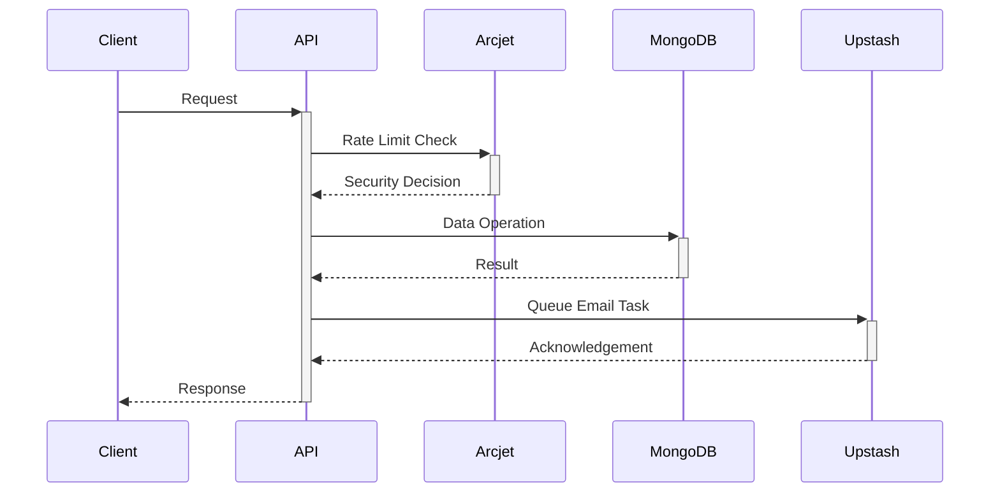

<div align="center">
  
  <h1>🚀 Subscriptify Engine</h1>

  <p>
    
    <span style="display:inline-block; width:12px;"></span>
    
    <span style="display:inline-block; width:12px;"></span>
    
  </p>
</div>


## 📦 Features

- **Secure Authentication** - JWT-based user authentication with role-based access
- **Subscription Management** - Full CRUD operations for subscription tracking
- **Smart Rate Limiting** - Arcjet integration for API security & bot protection
- **Automated Workflows** - Upstash-powered email reminders & notifications
- **Production-Ready** - Error handling, input validation, and logging
- **Email Integration** - Nodemailer templates for transactional emails

## 🛠 Tech Stack

**Version Prerequisites**
- Node.js 18.x
- Express 4.x
- MongoDB 6.x

**Security**
- JSON Web Tokens (JWT)
- Arcjet Rate Limiting
- Helmet & CORS

**Services**
- Upstash QStash (Workflow scheduling)
- Nodemailer (Email delivery)

## ⚡ Quick Start

### Prerequisites
- Node.js 18+
- MongoDB instance
- Upstash account (for QStash)

```bash
# Clone repository
git clone https://github.com/MuhammadTanveerAbbas/Subscriptify-Engine.git
cd Subscriptify-Engine

# Install dependencies
npm install

# Configure environment
cp .env.example .env.local
nano .env.local

# Start development server
npm run dev
```
API will be running at `http://localhost:5500`

## 🔐 Environment Variables

Required configuration in `.env.local`:
```ini
# Core
PORT=5500
DB_URI=mongodb://localhost:27017/subscriptify
JWT_SECRET=your_secure_key_here

# Security
ARCJET_KEY=your_arcjet_key
ARCJET_ENV=development

# Workflows
QSTASH_URL=https://qstash.upstash.io
QSTASH_TOKEN=your_upstash_token

# Email
EMAIL_PASSWORD=your_email_service_password
```

## 📂 Project Structure

```bash
├── config/          # Service configurations
├── controllers/     # Business logic handlers
├── database/        # MongoDB connection
├── middlewares/     # Authentication & security
├── models/          # MongoDB schemas
├── routes/          # API endpoints
└── utils/           # Email utilities
```

## 🌐 API Endpoints

| Category       | Endpoints                          |
|----------------|------------------------------------|
| Authentication | `/api/auth/login`, `/api/auth/register` |
| Users          | `/api/users/*` (CRUD operations)   |
| Subscriptions  | `/api/subscriptions/*` (Manage plans) |
| Workflows      | `/api/workflows/reminders`         |

## 🛡 Security Architecture



## 📬 Email Workflows

Automated reminders powered by:
1. Upstash QStash for scheduling
2. Nodemailer for email delivery
3. Customizable HTML templates
4. Retry logic for failed deliveries

## 📜 License

This project is licensed under the [MIT License](LICENSE).

---

[](https://documenter.getpostman.com/view/12345678/2sA3BhDf)
[](https://opensource.org/licenses/MIT)
